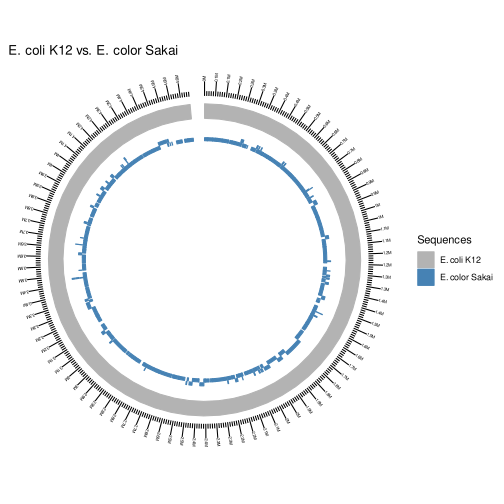

.. _quickstart:

Quickstart
==========

Get the data
------------

To keep things simple and reproducible, let's work with the reference *E. coli* genomes `K12 <https://www.ncbi.nlm.nih.gov/genome?LinkName=nuccore_genome&from_uid=545778205>`_ and `Sakai <https://www.ncbi.nlm.nih.gov/assembly/GCF_000008865.2>`_:

.. code-block:: bash

   ## download ecoli genome Sakai
   wget \
    https://ftp.ncbi.nlm.nih.gov/genomes/all/GCF/000/008/865/GCF_000008865.2_ASM886v2/GCF_000008865.2_ASM886v2_genomic.fna.gz \
    -O ecoli_sakai.fna.gz && \
   gzip -d ecoli_sakai.fna.gz

   ## download ecoli genome K12
   wget \
    https://ftp.ncbi.nlm.nih.gov/genomes/all/GCF/000/005/845/GCF_000005845.2_ASM584v2/GCF_000005845.2_ASM584v2_genomic.fna.gz \
    -O ecoli_k12.fna.gz && \
   gzip -d ecoli_k12.fna.gz

Run the script
--------------

This script is designed to:

* Perform whole genome alignment between FASTAs with `nucmer <https://github.com/mummer4/mummer>`_.
* Filter alignments by length and identity
* Plot these alignments in circular visualisation with `ggbio <https://bioconductor.org/packages/release/bioc/html/ggbio.html>`_.

It is an automation of the methods described by Taylor Reiter at https://taylorreiter.github.io/2019-05-11-Visualizing-NUCmer-Output/.

.. code-block:: bash

   # run plot_nucmer
   plot_nucmer --subject ecoli_k12.fna --sprefix "E. coli K12" --query ecoli_sakai.fna --qprefix "E. color Sakai"

This will create all the required data for the plot, including the Rscript `plot_nucmer.R` in the running directory. See the created plot:

.. tip::

  Click in the image for zoom.

Takeaway notes
--------------

Inside the working directory, after the script runs, all the files required to recreating the plot will be available, including the Rscript used for the job. The plot is written in SVG so users can further edit it in software like inkscape to their heart's content.
