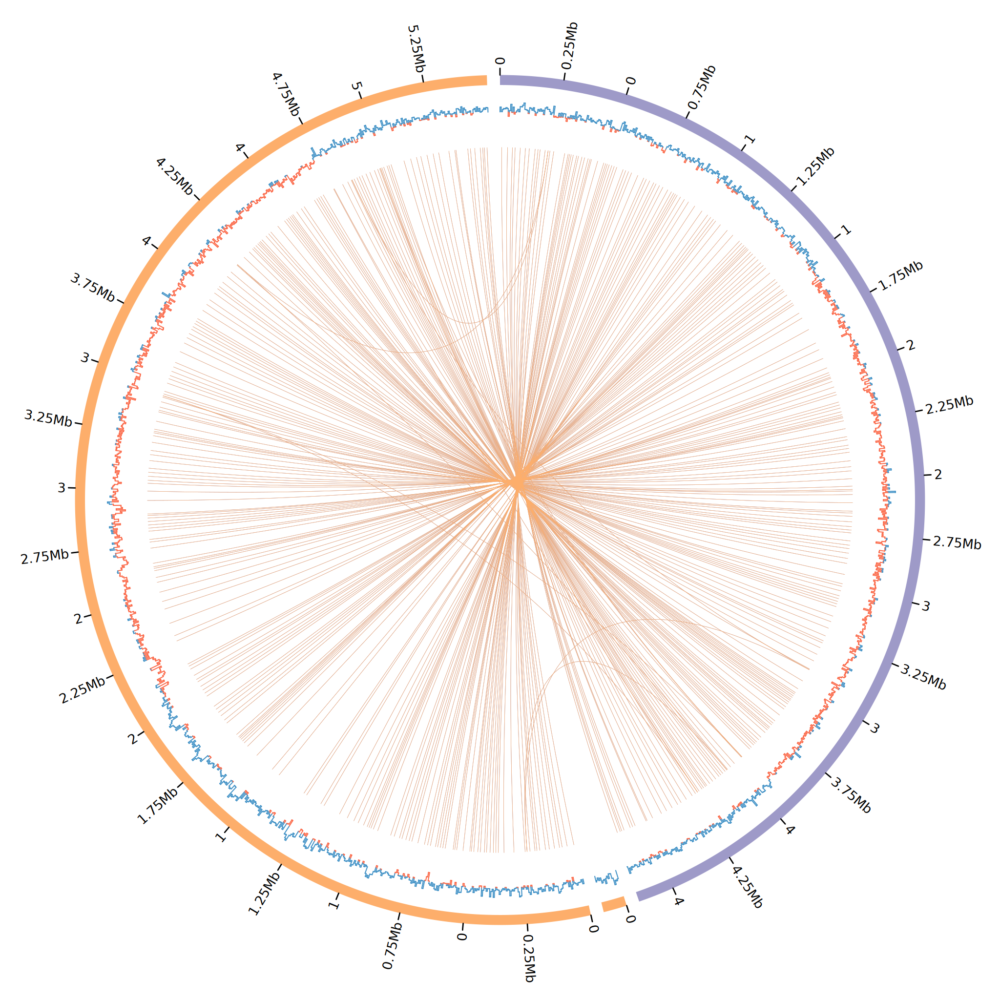
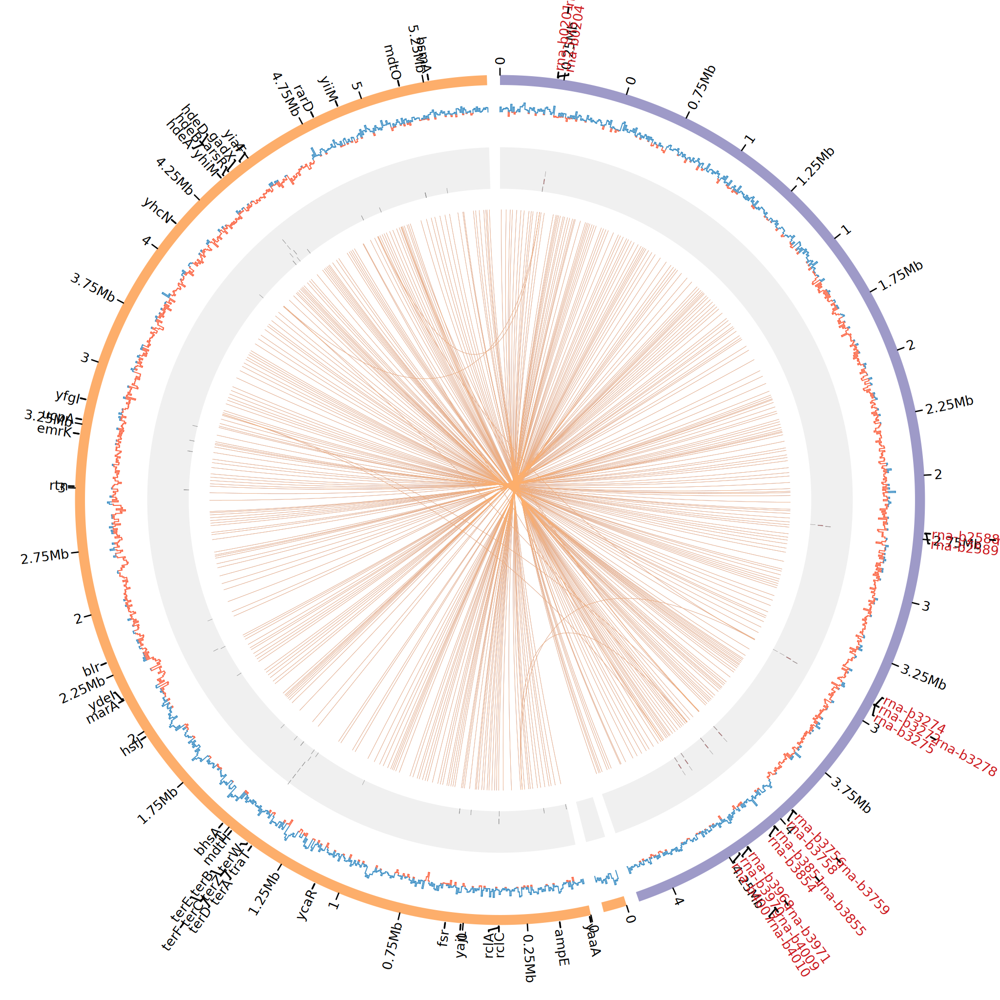

.. _quickstart:

Quickstart
==========

Minimal example
---------------

Get the data
""""""""""""

To keep things simple and reproducible, let's work with the reference *E. coli* genomes `K12 <https://www.ncbi.nlm.nih.gov/genome?LinkName=nuccore_genome&from_uid=545778205>`_ and `Sakai <https://www.ncbi.nlm.nih.gov/assembly/GCF_000008865.2>`_:

.. code-block:: bash

   ## download ecoli genome Sakai
   wget \
    https://ftp.ncbi.nlm.nih.gov/genomes/all/GCF/000/008/865/GCF_000008865.2_ASM886v2/GCF_000008865.2_ASM886v2_genomic.fna.gz \
    -O ecoli_sakai.fna.gz && \
   gzip -d ecoli_sakai.fna.gz

   ## download ecoli genome K12
   wget \
    https://ftp.ncbi.nlm.nih.gov/genomes/all/GCF/000/005/845/GCF_000005845.2_ASM584v2/GCF_000005845.2_ASM584v2_genomic.fna.gz \
    -O ecoli_k12.fna.gz && \
  gzip -d ecoli_k12.fna.gz

Prepare input
"""""""""""""

Before running the script, we must prepare the CSV that is used as input. This CSV must have:

* <FASTA PATH>,<PREFIX>,<COLOR>

We can prepare this csv with:

.. code-block:: bash

   echo "ecoli_k12.fna,K12,purple" > input.fofn
   echo "ecoli_sakai.fna,SAKAI,lorange" >> input.fofn

The file must look like this (input.fofn):

.. code-block:: bash

   ecoli_k12.fna,K12,purple
   ecoli_sakai.fna,SAKAI,lorange

Create the circos plot
""""""""""""""""""""""

With that, we can finally create a minimal circos configuration file and plots having:

* Ideograms
* Tick marks
* GC Skew
* Similarity links

.. code-block:: bash

   # run easy_circos
   plot_circos --fofn input.fofn

This will create all the circos configuration files and required data files under the ``results`` folder (Can be changed with ``--outdir``). See the created plot:

.. tip::

  Click in the image for zoom.

Example with 2D tracks
----------------------

Additionally, the scripts also makes it easy for you to draw plots with 2d tracks. For the moment, the 2D tracks available are:

* Tiles
* Text labels

    The 2D tracks files must be configured as shown in the circos manual: http://circos.ca/documentation/tutorials/configuration/data_files.

We now that not all user's are familiar with quick and easier ways to manipulate tabular data and, that the majority of genome annotation data are in GFF. Thus, we provide to quick functions with ``awk`` so that users can manipulate GFF files to create circos compliant TSVs for text labels and tiles. See below:

.. note::

   We will use the same genomes and input.fofn file used above.

Download GFF file
"""""""""""""""""

Let's get the GFF annotation file for both genomes:

.. code-block:: bash

   # download ecoli k12 annotation
   wget \
    https://ftp.ncbi.nlm.nih.gov/genomes/all/GCF/000/005/845/GCF_000005845.2_ASM584v2/GCF_000005845.2_ASM584v2_genomic.gff.gz \
    wget -O ecoli_k12.gff.gz
   gzip -d ecoli_k12.gff.gz

   # download ecoli sakai annotation
   wget \
    https://ftp.ncbi.nlm.nih.gov/genomes/all/GCF/000/008/865/GCF_000008865.2_ASM886v2/GCF_000008865.2_ASM886v2_genomic.gff.gz \
    wget -O ecoli_sakai.gff.gz
   gzip -d ecoli_sakai.gff.gz

Create text labels
""""""""""""""""""

For creating text labels we provide an script that is executed as:

* ``plot_circos [ --gff2labels <FEATURES> <PATTERN> <ATTRIBUTE> <COLOR> <GFF> ]``

  + <FEATURES> --> select GFF files that has this string as features (3rd column).
  + <PATTERN> --> select GFF lines that have this pattern.
  + <ATTRIBUTE> --> use the value of this key from the GFF attributes columns (9th column) as label
  + <COLOR> --> give this labels the following color
  + <GFF> --> use this GFF

.. note::

  For <FEATURES> and <PATTERN> users can use "" to match anything, and "|" to match
  more than one string. E.g. ``plot_circos --gff2labels "" "acrA|mdt" ID red ecoli_k12.gff``.

Thus, to create a circos compliant text label file we can run:

.. code-block:: bash

   # Sakai GFF features
   # search all lines with feature type "CDS" (3rd column)
   # all lines that have the pattern "resistance"
   # getting the value of the "gene" key in the 9th column as label
   # creating text label colors as "black"
   plot_circos --gff2labels CDS resistance gene black ecoli_sakai.gff > circos_labels.txt

   # K12 GFF features
   # search all lines with feature type "rRNA" (3rd column)
   # any line related to rRNA features, using "" as pattern
   # getting the value of the "ID" key in the 9th column as label
   # creating text label colors as "vdred"
   plot_circos --gff2labels rRNA "" ID vdred ecoli_k12.gff >> circos_labels.txt

.. note::

   You can create any labels as you like. You must only config them correctly and concatenate them in a single file.

The file must look like this:

.. code-block:: bash

   #chr	start	end	label	options	comment
   NC_002695.2	5700	6476	yaaA	color=black	# attributes: ID=cds-NP_308033.1;Parent=gene-ECs_0006;Dbxref=Genbank:NP_308033.1;Name=NP_308033.1;gbkey=CDS;gene=yaaA;locus_tag=ECs_0006;product=peroxide resistance protein;protein_id=NP_308033.1;transl_table=11
   NC_002695.2	123771	124625	ampE	color=black	# attributes: ID=cds-NP_308142.1;Parent=gene-ECs_0115;Dbxref=Genbank:NP_308142.1;Name=NP_308142.1;gbkey=CDS;gene=ampE;locus_tag=ECs_0115;product=ampicillin resistance inner membrane protein AmpE;protein_id=NP_308142.1;transl_table=11
   NC_002695.2	360441	361034	rclC	color=black	# attributes: ID=cds-NP_308366.1;Parent=gene-ECs_0340;Dbxref=Genbank:NP_308366.1;Name=NP_308366.1;gbkey=CDS;gene=rclC;locus_tag=ECs_0340;product=reactive chlorine species stress resistance inner membrane protein;protein_id=NP_308366.1;transl_table=11
   NC_002695.2	361391	362716	rclA	color=black	# attributes: ID=cds-NP_308369.2;Parent=gene-ECs_0342;Dbxref=Genbank:NP_308369.2;Name=NP_308369.2;gbkey=CDS;gene=rclA;locus_tag=ECs_0342;product=pyridine nucleotide-dependent disulfide oxidoreductase of reactive chlorine stress species RCS resistance;protein_id=NP_308369.2;transl_table=11
   [...]

Create tiles
""""""""""""

For creating circos tiles we provide an script that is executed as:

* ``plot_circos [ --gff2tiles  <FEATURES> <PATTERN> <COLOR> <GFF> ]``

  + <FEATURES> --> select GFF files that has this string as features (3rd column).
  + <PATTERN> --> select GFF lines that have this pattern
  + <COLOR> --> give this labels the following color
  + <GFF> --> use this GFF

.. tip::

  For <FEATURES> and <PATTERN> users can use "" to match anything, and "|" to match
  more than one string. E.g. ``plot_circos --gff2tiles "" "acrA|mdt" red ecoli_k12.gff``.

We will create the tiles for the same features that we used for the labels. Just to keep it simple. But, we could create for any feature. Thus, to create our circos compliant tiles file for the same features we can run:

.. code-block:: bash

   # Sakai GFF features
   # search all lines with feature type "CDS" (3rd column)
   # all lines that have the pattern "resistance"
   # creating tiles colors as "black"
   plot_circos --gff2tiles CDS resistance black ecoli_sakai.gff > circos_tiles.txt

   # K12 GFF features
   # search in the all lines with feature type "rRNA" (3rd column)
   # any line related to rRNA features, using "" as pattern
   # creating tiles colors as "vdred"
   plot_circos --gff2tiles rRNA "" vdred ecoli_k12.gff >> circos_tiles.txt

The file must look like this:

.. code-block:: bash

   #chr    start   end     options comment
   NC_002695.2     5700    6476    color=black     # attributes: ID=cds-NP_308033.1;Parent=gene-ECs_0006;Dbxref=Genbank:NP_308033.1;Name=NP_308033.1;gbkey=CDS;gene=yaaA;locus_tag=ECs_0006;product=peroxide resistance protein;protein_id=NP_308033.1;transl_table=11
   NC_002695.2     123771  124625  color=black     # attributes: ID=cds-NP_308142.1;Parent=gene-ECs_0115;Dbxref=Genbank:NP_308142.1;Name=NP_308142.1;gbkey=CDS;gene=ampE;locus_tag=ECs_0115;product=ampicillin resistance inner membrane protein AmpE;protein_id=NP_308142.1;transl_table=11
   NC_002695.2     360441  361034  color=black     # attributes: ID=cds-NP_308366.1;Parent=gene-ECs_0340;Dbxref=Genbank:NP_308366.1;Name=NP_308366.1;gbkey=CDS;gene=rclC;locus_tag=ECs_0340;product=reactive chlorine species stress resistance inner membrane protein;protein_id=NP_308366.1;transl_table=11
   NC_002695.2     361391  362716  color=black     # attributes: ID=cds-NP_308369.2;Parent=gene-ECs_0342;Dbxref=Genbank:NP_308369.2;Name=NP_308369.2;gbkey=CDS;gene=rclA;locus_tag=ECs_0342;product=pyridine nucleotide-dependent disulfide oxidoreductase of reactive chlorine stress species RCS resistance;protein_id=NP_308369.2;transl_table=11
   [...]

Create the circos plot
""""""""""""""""""""""

With that, we can finally create a minimal circos configuration file and plots having:

* Ideograms
* Tick marks
* GC Skew
* Similarity links
* Text labels
* Tiles

.. code-block:: bash

   # run easy_circos
   plot_circos --fofn input.fofn --labels circos_labels.txt --tiles circos_tiles.txt --threads 7

This will create all the circos configuration files and required data files under the ``results`` folder (Can be changed with ``--outdir``). See the created plot:

.. tip::

  Click in the image for zoom.

Takeaway notes
--------------

Under the ``results/conf`` file you will have all the circos configuration plots. With that, you can further customize and increment the plot as you desire. For that, you must understand circos conf files. `See their manual <http://circos.ca/documentation/tutorials/configuration/configuration_files/>`_
